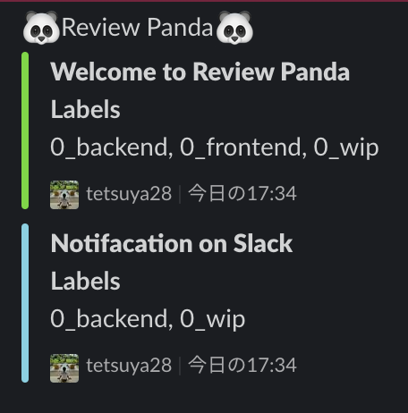

## Review Panda
This is to notify GitHub issue(s) that has specified label(s) to slack.
(No meaning in `Panda`)



## Setup
```
make deploy-stg
make deploy-prod
```

By default, scheduled times are `9AM, 17PM` in JST.  
To override these times with cron format like below.  

```
CRON=cron(0 * * * ? *) make deploy-stg
```

Also, please specify a AWS profile name if you want.  
By default, `default` profile is used.  
```
PROFILE=xxx make deploy-stg
```

### Prereuirement
- [direnv](https://github.com/direnv/direnv)
- [serverless](https://www.serverless.com/)

### Environmental variable
- REPOSITORY_OWNER
- REPOSITORY_NAME
- GITHUB_TOKEN
- GITHUB_LABELS
  - `AND` : `,`
  - `OR` : `:`
  - e.g.
    - `GITHUB_LABELS="Review:Notify"`
      - Search issues with `Review` or `Notify` labels
    - `GITHUB_LABELS="Review,Notify"`
      - Search isseus with `Revies` and `Notify` labls
  - Also, you can specify both of them
    - e.g.
      - `GITHUB_LABELS="Foo,Bar:Hoge,Huga"`
- SLACK_WEBHOOK_URL
  - e.g
    - `SLACK_WEBHOOK_URL=https://hooks.slack.com/services/XXXXXXXX/ZZZZZZZZZZ/aaaaaaaaaaaaa`

### Etc
Feel free to contributions by PRs, Issues.
